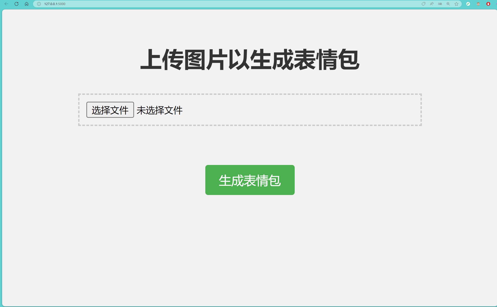
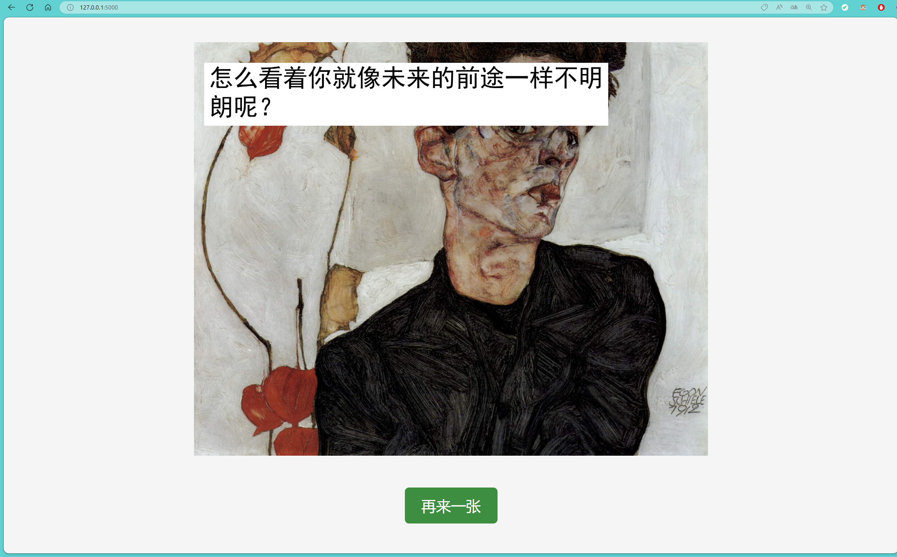

# Meme-GPT / GPT表情包生成器  

This document and the entire project were generated entirely by GPT-4.  

本文及本项目完全由 GPT-4 生成。  

This is a simple meme generator built with Flask, which combines OpenAI and Replicate to generate interesting meme text from an uploaded image.  

这是一个使用 Flask 构建的简单表情包生成器，它结合了 OpenAI 和 Replicate 来从上传的图片生成有趣的表情包文案。  

<p float="left">
  
  
</p>

## Features / 功能

1. Upload an image / 上传图片
2. Use Replicate's blip-2 API to generate image descriptions / 调用 Replicate 的 blip-2 API 生成图片描述
3. Generate interesting meme text based on the image description / 根据图片描述生成有趣的表情包文案
4. Add text to the image and generate the final meme image / 在图片上添加文案并生成最终的表情包图片

## Dependencies / 依赖

- Flask
- OpenAI
- Replicate
- Pillow

## Installation / 安装

1. Clone this repository / 克隆此仓库
2. Create a file named `.env` in the project root directory and set the following environment variables / 在项目根目录下创建一个名为 `.env` 的文件，并设置以下环境变量：  

```
REPLICATE_API_TOKEN=your_replicate_api_token  
OPENAI_API_KEY=your_openai_api_key
```

3. Install dependencies / 安装依赖：
```
pip install -r requirements.txt
```
4. Run the application / 运行应用：
```
python app.py
```
5. Access in your browser / 在浏览器中访问：[http://127.0.0.1:5000/](http://127.0.0.1:5000/)

## Usage / 使用方法

1. Upload an image on the homepage / 在首页上传一张图片
2. Click the "Generate Meme" button / 点击“生成表情包”按钮
3. View the generated meme image and download or share / 查看生成的表情包图片并下载或分享

## File Structure / 文件结构

- `app.py`: Contains the main Flask code and various function definitions / 包含主要的 Flask 代码和各种功能函数
- `templates/index.html`: Homepage HTML template for uploading images / 首页 HTML 模板，用于上传图片
- `templates/result.html`: Result page HTML template for displaying the generated meme image / 结果页面 HTML 模板，用于展示生成的表情包图片

## Notes / 注意事项

1. Make sure you have obtained API keys for Replicate and OpenAI / 请确保已获取 Replicate 和 OpenAI 的 API 密钥。
2. Be mindful of the number of API calls and costs, and avoid excessive use / 请注意 API 调用次数和费用，避免过度使用。
3. This project is for learning and reference purposes only. Please do not use it for illegal or commercial purposes / 本项目仅供学习和参考，请勿用于非法或商业用途。

